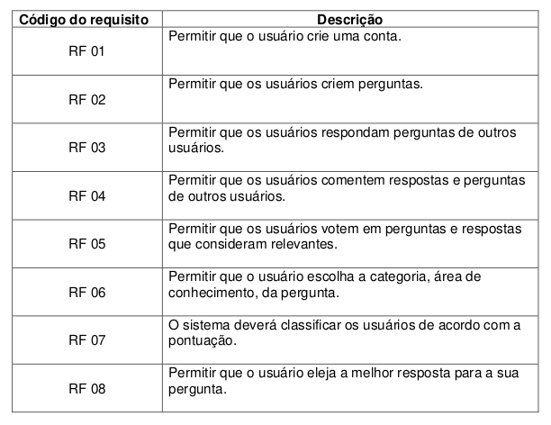
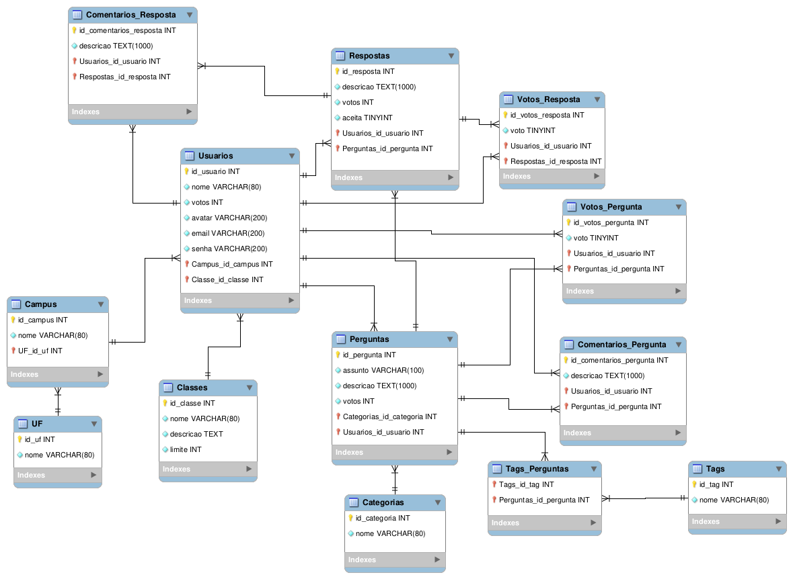

# Ifoverflow

Version: [v0.17.0]

## Table to Entity  

- UF - States  
- Campus - Campus  
- Usuarios - Users  
- Classes - Ratings  
- Categorias - Categories  
- Perguntas - Questions  
- Respostas - Answers  
- Comentarios_Resposta - Comments_Answer  
- Comentarios_Pergunta - Comments_Question  
- Tags - Tags  
- Tags_Perguntas - Tags_Questions  

## Structure
```
———- Users ————-
UF - States
Campus - Campus
Usuarios - Users
Classes - Ratings
——— Questions --——
Categorias - Categories
Perguntas - Questions
Tags - Tags
Tags_Perguntas - Tags_Questions
——— Comments ——-
Comentarios_Resposta - Comments_Answer
Comentarios_Pergunta - Comments_Question
———————————
Respostas - Answers  
```

## RFs

  

## DRN

  
